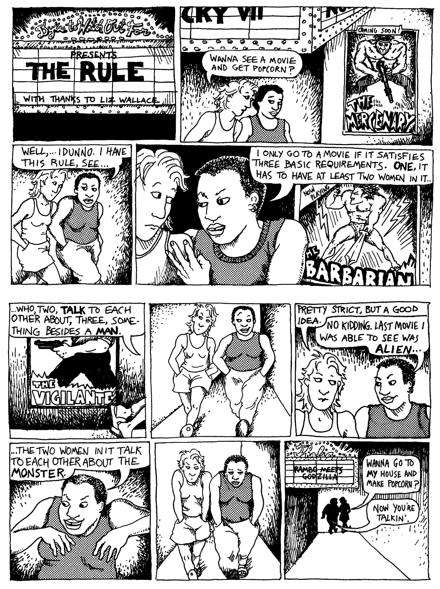
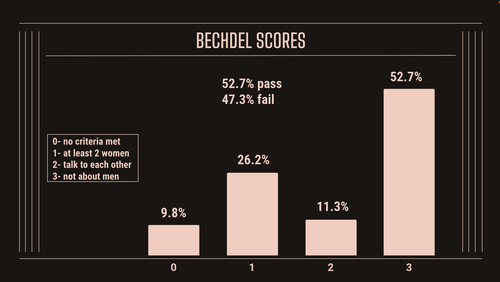
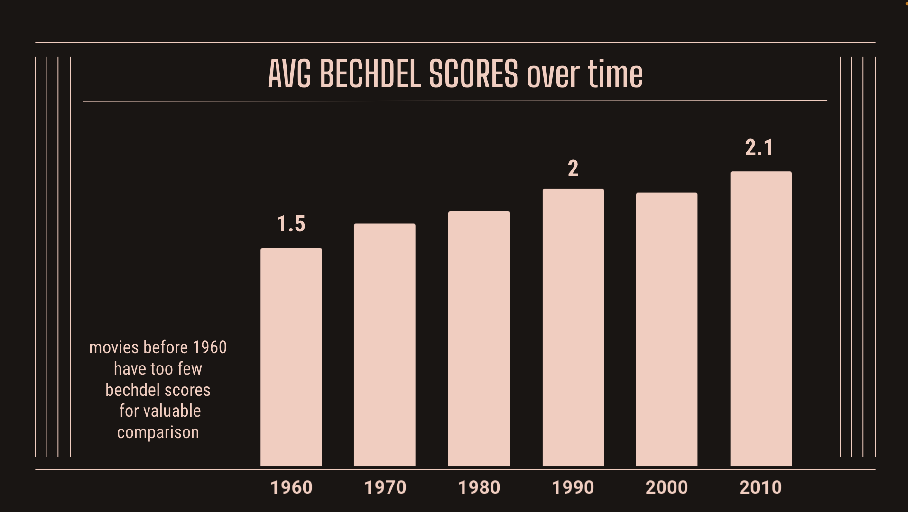
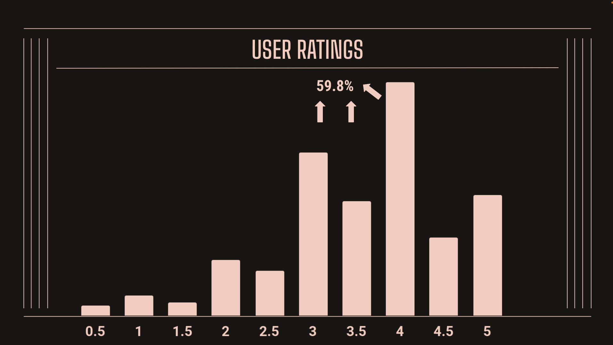
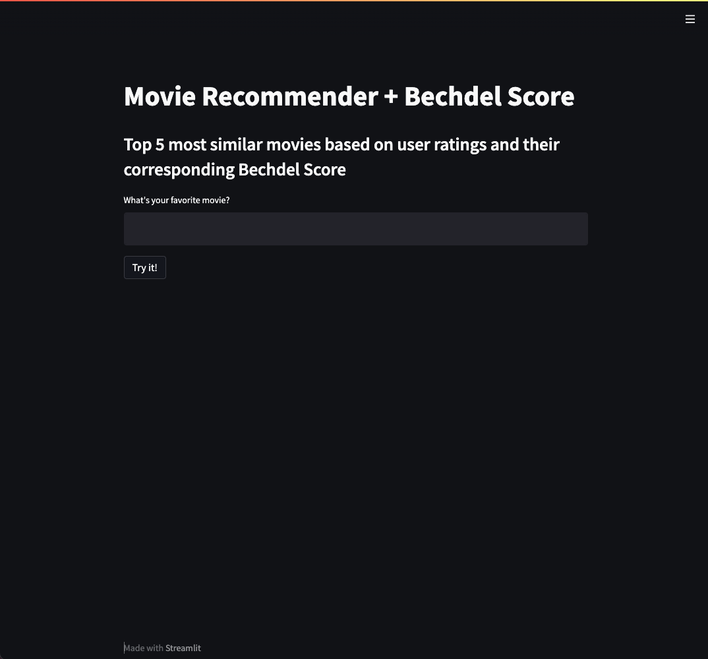

# BECHDEL-WALLACE MOVIE RECOMMENDER

# Problem Statement
Create a user-based collaborative movie recommender system that considers Bechdel scores in filtering recommendations

### What is a recommender system?
A recommender system takes in data about a product from many sources including consumer ratings and activity and matches the user with said product based on their ratings and activity. Recommender systems are used broadly to suggest anything and everything we consume.

[link to source](https://towardsdatascience.com/brief-on-recommender-systems-b86a1068a4dd)

### What is the Bechdel Test?
The Bechdel Test (The Bechdel-Wallace Test) is commonly used to determine the gender-inclusivity of media. It was borne of a comic strip in 1985 penned by Allison Bechdel and Liz Wallace where one character shares a rule they have about watching movies where women are not represented. For the movie to pass "the test" it must:
1. have at least two women
2. who talk to each other
3. about something other than men

[link to source](https://dykestowatchoutfor.com/the-rule/)

After it was published, and for many years therafter, the comic and "the test" had a loyal following among LGBTQ+ and feminist communities. In the 2010s it began to be used in more mainstream environments and as a measurement of gender inclusivity in Hollywood.

Though it is not a complete measurement of representation by any means, it is a simple start and will be used in this project to help the user make decisions about which recommended movies to choose.

For an example of a more robust measurement of representation in film, go to [the rep project](https://therepproject.org/)

Or to rate movies on your own beyond the bechdel, [check this out](https://therepproject.org/wp-content/uploads/2021/08/The-Rep-Test-2.0.pdf)

---
## Table of Contents:

 ##### 1. Workflow

 ##### 2. Streamlit App
 
 ##### 3. Insights and Conclusions

 ##### 4. Data Dictionary

 ##### 5. Datasets

 ##### 6. Notebooks
 
 ##### 7. Images

---
### 1. Workflow 

 - Data aquisition

 - Data cleaning and preprocessing

 - Modeling

 - Visualization

 - Identify next steps

#### Data Aquisition
Bechdel-Wallace movie scores scraped from  [Bechdel Test Movie List API](https://bechdeltest.com/api/v1/getMoviesByTitle)

Work can be seen here: [webscrape from Bechdel Test Movie List](notebooks/bechdel_get_data.ipynb)

Other movie data downloaded in csv format from [Movielens](https://grouplens.org/datasets/movielens/)

#### Data Cleaning and Preprocessing
The scraped [Bechdel dataset](datasets/bechdel.csv) was processed by:
    
   - Dropping columns that were not necessary for a recommender or were captured in the Movielens dataset:
visible, date(reviewed), title, year, submitterid, dubious, id  

The Movielens datasets: [movies](datasets/movies.csv), [ratings](datasets/ratings.csv), and [links](datasets/links.csv)
were procesed by:
    
   - Joining on movieId
   - Dropping redundant or irrelevant columns: 
movieId, tmdbId, timestamp, 
   
Bechdel and Movielens were joined on imdbid and imdbId respectively in [this notebook](notebooks/merge_final.ipynb)

The data was 1000,836 user ratings from 610 users who rated on a scale from 0.5 - 5.0. They rated 9742 movies produced from 1902 - 2018. And though the bechdel test data contained 9417 movies, [final merged data](datasets/final.csv) came out around 80,000 ratings on about 5000 movies with corresponding bechdel scores.

#### Modeling
The cleaned and merged data was pivoted, making the index the movie title and each column a different user. The corresponding values are the user's rating for each movie.
The divoted dataframe was then turned into a sparse matrix to reduce file size. The ratings were now able to be compared. The cosine of the distance between the ratings was used to determine how similar the ratings were.
The final recommender system is a dataframe with movie titles along both axis and the values are the similarity score of one movie to the other based on the user ratings.
When a movie is entered into an extraction algorithm, the function pulls the 5 movies with the highest relative scores to the entry. 
The Bechdel scores are also provided for the top movies so that the user might have an additional filter for making viewing choices.

#### Visualizations
Below are a few visuals from the data:

#### Next Steps

There are many improvements that could be made to this recommender and corresponding [Streamlit](https://streamlit.io/) app.
The user interface could be more robust, providing many options for refinement and leveraging the tools available within the Streamlit platform.

The addition of a content-based recommender, based on genre, actors, directors, writers, etc would also enhance the accuracy and desirability of the system.
Images, links, and the option for the user to rate movies on their own. For example the last three movies seen and how recently would give a brief profile of the user in order to match with the watching frequency of other users as well.
Additionally, data with more recently released and upcoming films 
would also improve the system.

Finally, more robust inclusion metrics would make the system much more impactful, giving the user an opportunity to search exclusively for movies that meet their personal requirements and filter out those that do not.

---
### 2. Streamlit App

[check out the app here](https://share.streamlit.io/colepoppsinger/streamlit/app.py)

---
### 3. Insights and Conclusions

The challenge with user-based collaborative recommenders is the cold start, where we need information from the user to make a recommendation. With the Streamlit app, a user is able to input their first bit of data with the selection of their favorite movie, presumably a movie to which they would give a favorable rating. The result is a list of movies that were also favorably rated by other users who gave high ratings to the favorite movie.

The problem of inclusivity in media, and film specifcally is massive. There are many ways in which representation can be improved and without visibilty to the problem and access to data, informed decisions cannot be made by consumers.

Though this recommmender system can be improved on many fronts, it is a simple start to providing information for making decisions around diversity and inclusion. 

---
### 4. Data Dictionary:
[data dictionary](data_dictionary.md)

---
### 5. Datasets:
[movies](datasets/movies.csv)
, [ratings](datasets/ratings.csv)
, [links](datasets/links.csv)
, [bechdel](datasets/bechdel.csv)
, [all](datasets/all.csv)
, [final](datasets/final.csv)

---
### 5. Notebooks:
[webscrape from bechdel](notebooks/bechdel_get_data.ipynb)
, [data cleaning and merging](notebooks/merge_final.ipynb)
, [recommender](notebooks/recommender_user_ratings.ipynb)
, [eda](notebooks/eda.ipynb) 

---

### 6. Images

[app](images/app.png)
, [avg_bechdel_time](images/avg_bechdel_time.png)
, [bechdel_scores](images/bechdel_scores.png)
, [recommender](images/recommender.png)
, [rule](images/rule.jpeg)
, [user_ratings](images/user_ratings.png)
